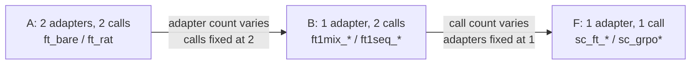

# Experiment registry

The single source of truth for **what each arm is** and **what it needs to run**.
Numbers live in [BASELINE_RESULTS.md](BASELINE_RESULTS.md), which is generated by
`baseline.eval` and should never be hand-edited.

- Design rationale for the two-call grid: [BASELINE.md](BASELINE.md)
- The GRPO ladder and its phases: [GRPO.md](GRPO.md)
- What was run when, and what came of it: [EXPERIMENT_LOG.md](EXPERIMENT_LOG.md)
- Machine-readable coverage: `outputs/baseline_eval/coverage.csv`

---

## 1. The structural matrix

Every arm sits somewhere in a 2x2 of **how many adapters** carry the adaptation
and **how many generation calls** produce the answer.

|  | 2 adapters | 1 adapter |
|---|---|---|
| **2-call** | **A** — `ft_bare`, `ft_rat`, `grpo_pair_{dec,joint}` | **B** — `ft1mix_*`, `ft1seq_*`, `grpo_mix_{dec,joint}` |
| **1-call** | structurally impossible | **F** — `sc_ft_bare`, `sc_ft_rat`, `sc_grpo*` |

The bottom-left cell cannot exist: with one generation there is no second call
for a second adapter to serve.

**GRPO now spans all three live cells.** `sc_grpo` (cell F) was the first; the
`grpo_pair_*` (A) and `grpo_mix_*` (B) arms extend RL across the matrix so the
adapter×call ablation holds under GRPO as it does under SFT. Each two-call cell is
run under two credit schemes — *decoupled* (each call a stationary GRPO problem,
T2 on frozen predicted T1) and *joint* (one shared advantage over both turns) — to
price the coupling single-call sidestepped. See [GRPO_TWOCALL.md](GRPO_TWOCALL.md).

This matters because **A vs F moves two variables at once.** A difference between
`ft_bare` and `sc_ft_bare` could be the call count, the adapter count, or both,
and nothing in the numbers separates them. Cell B is the bridge:



Read **A against B** for the cost of collapsing two adapters into one, and
**B against F** for the cost of collapsing two calls into one. Only compare
within a fixed context length and training target.

---

## 2. Data

| | File | Rows | Role |
|---|---|---:|---|
| Train | `data/manual/HLQC_balanced_manual.csv` | 1,925 | LoRA training and few-shot exemplars |
| Eval | `data/manual/MIV6.3A_manual.csv` | 821 | every reported number |

There is **no dev split**. Hyperparameters were not tuned per arm; they are fixed
across the grid (§5) so that arms differ only in the axis under study. The two
corpora are disjoint, so no evaluation utterance appears in any prompt or target.

Both tiers are predicted for every utterance: **T1** is the coarse group and
**T2** the fine code within it. Counsellor and client have separate vocabularies,
which is why results are broken out by scope (`all`, `counsellor`, `client`).

### Context length

`ctx` is the number of preceding volleys shown with the target utterance. The
grid is run at **ctx=3** (the AutoMISC paper's setting) and **ctx=5**. Context
length is not a free parameter at evaluation time: exemplars and rationales are
frozen *per context length*, because a rationale written with 5 volleys in view
can cite material invisible at 3.

---

## 3. Frozen artifacts

Generated once and reused, so a rerun of an arm is reproducible and the paid
gpt-4o calls happen exactly once.

| Artifact | Path | Gates |
|---|---|---|
| Few-shot exemplars, ctx3 | `data/fewshot/exemplars_ctx3.json` | `fs`, `sc_fs` at ctx3 |
| Few-shot exemplars, ctx5 | `data/fewshot/exemplars.json` | `fs`, `sc_fs` at ctx5 |
| Distilled rationales, ctx5 | `data/fine_tuning/rationales/hlqc_rationales_ctx5.json` | every `*_rat` arm at ctx5 |
| Distilled rationales, ctx3 | `data/fine_tuning/rationales/hlqc_rationales_ctx3.json` | every `*_rat` arm at ctx3 |
| Out-of-fold predicted T1, ctx5 | `data/fine_tuning/oof_t1/hlqc_oof_t1_ctx5.json` | `ft_bare_tfdyn`, `ft_bare_tfzero` at ctx5 |
| Out-of-fold predicted T1, ctx3 | `data/fine_tuning/oof_t1/hlqc_oof_t1_ctx3.json` | `ft_bare_tfdyn`, `ft_bare_tfzero` at ctx3 |

**Exemplars** are stratified by speaker and code: 6 counsellor T1 / 18 counsellor
T2, 3 client T1 / 14 client T2, so every code in the vocabulary is demonstrated
at least once. "Exemplar" and "shot" are the same thing; the count differs per
tier and speaker because the vocabularies differ.

**Rationales** are distilled from gpt-4o: it is shown the prompt *plus the gold
label* and asked to write the 1-2 sentence justification. They are therefore
**post-hoc** — conditioned on the answer, and so possibly unfaithful to any
reasoning that would independently produce it. This is a known limitation of
rationale distillation and belongs in the write-up, not a bug.

**Out-of-fold predicted T1** is what the teacher-forcing arms condition on. It
has to be out of fold: the production T1 adapter trained on all 1,925 HLQC rows,
so its predictions on those same rows are partly memorised and much cleaner than
the ~79% it manages on held-out data. The corpus is split into 5
conversation-level folds; each fold's rows are predicted by an adapter trained
only on the other four. Regenerate one fold at a time, then check calibration:

```bash
PYTHONPATH=src python -m baseline.oof_t1 train-fold   --ctx 5 --fold 0   # needs a GPU
PYTHONPATH=src python -m baseline.oof_t1 predict-fold --ctx 5 --fold 0
PYTHONPATH=src python -m baseline.oof_t1 report       --ctx 5
```

Pooled out-of-fold accuracy should sit near the production adapter's evaluation
figure. Far above it and the downstream arms are trained on gentler T1 noise than
they meet at inference, which makes their results lower bounds.

Regenerate rationales with:

```bash
PYTHONPATH=src python -m baseline.rationalize --ctx 3   # needs Azure gpt-4o, not a GPU
```

The run is checkpointed every 25 utterances and resumes, so an interrupted run
leaves a **partial but valid** file. `local_arm train` checks per-row coverage
and refuses to train on a partial file rather than silently dropping rows.

---

## 4. Arm registry

`style` is the inference prompt: `bare` = label-only, `cot` = rationale-first.
Two-call arms are evaluated under both; single-call arms only in the style they
were trained in, since asking a rationale-trained model to suppress its rationale
is the two-call experiment's question and is already answered there.

### Cell A — 2 adapters, 2 calls

| Arm | Trains on | Target | Styles | Needs |
|---|---|---|---|---|
| `ft_bare` | HLQC, T1 and T2 separately | bare label | bare, cot | — |
| `ft_rat` | HLQC, T1 and T2 separately | rationale + label | bare, cot | rationales for this ctx |

Two independent LoRAs, one per tier. The T2 adapter trains conditioned on the
**gold** T1 group; at inference it is conditioned on the **predicted** T1, so the
adapter sees the same conditional structure it was trained under. The runner
switches adapters between the two calls.

#### Teacher forcing on the T1 conditioning

T2 trains conditioned on the **gold** T1 but runs conditioned on the **predicted**
one, so about a fifth of T2 calls meet a group spec never paired with that
utterance in training. These three arms vary that single thing. `p_gold` is the
probability a T2 training example carries the gold T1, evaluated once per epoch.

| Arm | `p_gold` | Styles | Needs |
|---|---|---|---|
| `ft_bare_tffull` | `constant(1.0)` — the control | bare | base `ft_bare` T1 adapter |
| `ft_bare_tfdyn` | `linear(1.0 → 0.0)` | bare | + out-of-fold predicted T1 |
| `ft_bare_tfzero` | `constant(0.0)` | bare | + out-of-fold predicted T1 |

All three **share `ft_bare`'s T1 adapter by path** and retrain only T2, so the
axis moves one thing. The completion target stays the gold `t2_label_GT`; only
the conditioning changes, and no rows are dropped, so example counts match.

A declining `p_gold` needs the dataset rebuilt between epochs, so these run as
three chained 1-epoch stages under a constant LR with no warmup — three staged
cosine cycles are not one 3-epoch cosine. That is why `tffull` is trained rather
than reused from `ft_bare`: the three must share one procedure for the contrast
between them to mean anything. `ft_bare` vs `ft_bare_tffull` prices the staging.

Evaluated `Inf-Bare` only; `Inf-CoT` measures instruction compliance, which is a
different question `ft_bare` already answers.

Note "teacher forcing" is borrowed here. At the token level all three arms are
fully teacher forced; what varies is a field in the prompt, which is the stage
level. See [the campaign write-up](experiments/2026-08-19-teacher-forcing.md).

### Cell B — 1 adapter, 2 calls

One LoRA serves *both* calls. Inference is byte-for-byte the two-call flow of
cell A — same prompts, same T2-conditioned-on-predicted-T1, same compliance
accounting — so B differs from A in adapter count and nothing else.

| Arm | Regime | Target | Styles | Needs |
|---|---|---|---|---|
| `ft1mix_bare` | mixed | bare label | bare, cot | — |
| `ft1mix_rat` | mixed | rationale + label | bare, cot | rationales for this ctx |
| `ft1seq_bare` | sequential | bare label | bare, cot | — |
| `ft1seq_rat` | sequential | rationale + label | bare, cot | rationales for this ctx |

The two regimes differ only in the **order** the single adapter sees the data:

- **mixed** — concatenate the T1 and T2 rows, shuffle under `training.seed`,
  train 3 epochs.
- **sequential** — 3 epochs on T1, save, reload that adapter as trainable, 3
  epochs on T2.

Compute is matched by construction: mixed sees `3 x (1925 + 1925) = 11,550`
example-passes, sequential sees `3 x 1925 + 3 x 1925 = 11,550`. Any gap between
them is ordering, not budget.

**Watch T1 accuracy on `ft1seq`.** The T2 stage can overwrite what the T1 stage
learned. That is catastrophic forgetting, it is the reason the regime exists as
a separate arm, and it is a reportable result either way. `ft1seq` also keeps its
intermediate T1-only adapter at `<arm>/stage_t1/` if you need to confirm it.

#### GRPO in cells A and B

Reinforced two-call arms, warm-started from the SFT arm above and evaluated `cot`,
3 seeds, aggregated like `sc_grpo`. Full design: [GRPO_TWOCALL.md](GRPO_TWOCALL.md).

| Arm | Cell | Warm-start | Credit | Needs |
|---|---|---|---|---|
| `grpo_pair_dec` | A | `ft_bare` pair | decoupled | oof_t1 store (T2 conditioning) |
| `grpo_pair_joint` | A | `ft_bare` pair | joint | — |
| `grpo_mix_dec` | B | `ft1mix_bare` | decoupled | oof_t1 store |
| `grpo_mix_joint` | B | `ft1mix_bare` | joint | — |

Each carries `_unw` (no rare-class weighting) and `_cold` (from base) Phase-2
ablations, ctx5 only, like cell F. A T2-recovery probe
([recovery.py](../src/baseline/recovery.py)) measures whether the trained T2
recovers from a deliberately wrong injected T1 — unique to the two-call cells.

### Cell F — 1 adapter, 1 call

One generation emits the rationale and both tier labels together, so T2 is never
conditioned on a *committed* T1 — the model can revise both jointly.

| Arm | Adaptation | Style | Needs |
|---|---|---|---|
| `sc_ft_bare` | LoRA, bare labels | bare | — |
| `sc_ft_rat` | LoRA, rationale + labels | cot | rationales for this ctx |
| `sc_grpo` | GRPO from `sc_ft_bare`, rare-class weighting | cot | `sc_ft_bare` adapter |
| `sc_grpo_unw` | GRPO, no rare-class weighting | cot | `sc_ft_bare` adapter |
| `sc_grpo_cold` | GRPO from the base model | cot | — |

`sc_grpo*` run at 3 seeds (`sc_grpo_cold` at 1) and are reported as mean ± sample
standard deviation. `sc_grpo_unw` and `sc_grpo_cold` are Phase-2 ablations that
only ever answer a ctx5 question, so they are **not** expected at ctx3 and the
coverage table does not count them missing there.

### In-context controls (0 adapters)

| Arm | Calls | Styles | Needs |
|---|---:|---|---|
| `zs` | 2 | bare, cot | — |
| `fs` | 2 | bare, cot | exemplars for this ctx |
| `sc_zs` | 1 | cot | — |
| `sc_fs` | 1 | cot | exemplars for this ctx |

Run for both the **gpt4o** and **qwen** tiers where available. The gpt4o
fine-tuned arms are blocked on an Azure deployment and appear as missing in the
coverage table.

---

## 5. Shared settings

Identical across every Qwen arm, so arms differ only on the axis under study.
Source: [`conf/baseline_ft_local_config.yaml`](../conf/baseline_ft_local_config.yaml)
(two-call) and [`conf/grpo_config.yaml`](../conf/grpo_config.yaml) (single-call).

| | Value |
|---|---|
| Base model | `Qwen/Qwen2.5-7B-Instruct`, bf16, sdpa |
| LoRA | r=16, alpha=32, dropout=0.05 |
| LoRA targets | `q,k,v,o,gate,up,down_proj` |
| Epochs | 3 |
| Effective batch | 1 x 4 grad-accum |
| LR / schedule | 1e-4, cosine, 5% warmup |
| Max input (train) | 4,096 tokens |
| Max target | 256 tokens |
| Seed | 42 |
| Max new tokens (eval) | 256 |
| Max input (eval) | 4,096; 8,192 for few-shot arms |

Two deliberate choices worth knowing:

- **Max target 256** — measured over the frozen ctx5 rationales: mean 69, p99
  138, max 247 tokens. Set above the maximum so no target is truncated
  mid-sentence, which would train the model to emit unterminated JSON.
- **Max new tokens 256 everywhere** — generous on purpose. Four cells exist to
  measure instruction compliance (does a label-trained model emit a rationale
  when asked; does a rationale-trained one suppress it when told). A tight budget
  would clip a non-compliant rationale and surface it as a parse failure, turning
  a truncation artifact into a fake finding.

The frontier tier decodes gpt-4o through a JSON schema, which **forces** the
output shape. Those rows are marked `constrained` in the compliance table: the
model had no opportunity to disobey, so the figure is structural, not
behavioural. Compliance claims apply to Qwen only.

---

## 6. Metrics

All computed by [`src/baseline/eval.py`](../src/baseline/eval.py) over the 821
evaluation utterances, reported per tier level (T1, T2) and scope.

| Metric | Meaning |
|---|---|
| Accuracy | share of utterances given the correct code |
| Cohen's kappa | agreement corrected for chance; robust to the skewed code distribution |
| Macro-F1 (gold) | F1 averaged over codes **that occur in the gold labels** |
| Macro-F1 (learnable) | as gold, minus codes absent from the training corpus |
| Macro-F1 (all) | as gold, plus codes the model predicted that never occur in gold |

The three macro-F1 variants differ **only in which codes enter the average**, and
each answers a different question:

- **gold** is the number comparable to the published AutoMISC results. It
  includes codes like `TS+` and `AC-` that appear in the evaluation set but never
  in HLQC, so no arm trained here can predict them — they enter as guaranteed
  zeros and drag every trained arm down equally.
- **learnable** drops exactly those codes. It answers "how well did the model do
  on what it could possibly have learned", which is the fair comparison *between
  our arms*.
- **all** additionally charges the model for hallucinated codes that never occur
  in gold, each contributing 0. It catches an arm inventing vocabulary, which the
  other two would not penalise.

Read **learnable** when comparing arms to each other and **gold** when comparing
to the paper. A large gold-vs-learnable gap means unlearnable codes, not a weak
model; a large learnable-vs-all gap means the model is emitting codes that do not
belong.

Where an arm was run at several seeds the figure is the mean and the spread is
the sample standard deviation. Per-seed rows are in
`outputs/baseline_eval/comparison.csv`.

### Instruction compliance

Separately tracked in `outputs/baseline_eval/compliance.csv`: whether each cell
obeyed its inference instruction (`Inf-CoT` should produce a rationale,
`Inf-Bare` should not), plus unparseable rate and truncation counts.

### Faithfulness probe

Accuracy cannot tell whether an emitted rationale had anything to do with the
label — a model can produce fluent MI-flavoured prose and predict the code from
the utterance alone, scoring identically. The probe forces a rationale generated
for a *different* utterance with a *different* gold code into this utterance's
answer and lets the model continue. Forcing a prefix is itself an intervention,
so it runs against a control that forces the model's own rationale back in:

```
net flip rate = flip rate (donor rationale) - flip rate (own rationale)
```

High net flip means the label followed the substituted reasoning, so the
rationale was load-bearing. Near zero means the model had already decided and the
rationale is narration. **Donor-match** separates steering from disturbance:
drifting to a random third code means the swap merely confused the model, landing
on the donor's own code means it followed it.

Results are in [BASELINE_RESULTS.md](BASELINE_RESULTS.md) and discussed in
[GRPO.md](GRPO.md). The headline: read `sc_zs` first, because an *untrained*
model scores highest on every column, which means a forced prefix steering the
label is what autoregressive models do rather than evidence about training.

---

## 7. Running things

Training writes `train_metadata.json` beside each adapter recording target,
regime, adapter count, context length, dataset and hyperparameters, so every
result traces back to the run that produced it.

```bash
# Two-call arms (cells A and B). regime: pair | mixed | sequential
PYTHONPATH=src python -m baseline.local_arm train   --target bare --regime pair  --ctx 5
PYTHONPATH=src python -m baseline.local_arm train   --target bare --regime mixed --ctx 5
PYTHONPATH=src python -m baseline.local_arm predict --arm ft1mix_bare --inf bare --ctx 5

# Single-call arms (cell F)
PYTHONPATH=src python -m baseline.sc_arm train   --target bare --ctx 5
PYTHONPATH=src python -m baseline.sc_arm predict --arm sc_ft_bare --ctx 5

# Rescore everything present and regenerate BASELINE_RESULTS.md
PYTHONPATH=src python -m baseline.eval
```

On MLeRP, submit the whole two-call grid with dependencies wired from training to
prediction:

```bash
CTX=5 bash scripts/submit_local_grid.sh                  # all three regimes
CTX=3 REGIMES=pair bash scripts/submit_local_grid.sh     # cell A only
CTX=5 SKIP_TRAIN=1 bash scripts/submit_local_grid.sh     # adapters already exist
DRYRUN=1 CTX=3 bash scripts/submit_local_grid.sh         # print, submit nothing
```

`rat` arms are skipped automatically, with a message, when the rationale file for
that context length is absent. The single-call ladder has its own submitter,
`scripts/submit_grpo_ladder.sh`.

Prediction checkpoints every 25 utterances, so a requeued job resumes rather than
restarting.

---

## 8. Where results live

| Path | Contents |
|---|---|
| `data/annotated/baseline/<tier>_<arm>_inf_<style>_ctx<N>[_seed<S>].csv` | per-utterance predictions, raw generations, compliance flags |
| `outputs/baseline_eval/comparison.csv` | per-seed scores, machine-readable |
| `outputs/baseline_eval/compliance.csv` | per-cell instruction compliance |
| `outputs/baseline_eval/coverage.csv` | every intended cell marked done / missing |
| `outputs/baseline_eval/*_report.csv` | per-code precision / recall / F1 |
| `outputs/grpo/faithfulness_*.json` | rationale-swap probe |
| `docs/BASELINE_RESULTS.md` | generated report |

The filename **is** the experiment identifier and is parsed back into
`(tier, arm, style, ctx, seed)` by `baseline.eval`, so an arm added to the code
without a matching entry in the eval registry will be scored but will not appear
in the coverage audit.

Coverage marks each cell `done`, `partial`, `missing` or `extra`:

- **partial** — the file is valid but shorter than 821 rows. Prediction
  checkpoints every 25 utterances so a requeued job resumes instead of
  restarting, which means a *running* cell already has a scoreable file on disk.
  Its metrics are computed over whatever has landed so far and will move. Do not
  read a partial cell as a result.
- **extra** — scored but not part of the intended grid, usually a stale filename
  or a smoke run written to the real output directory by mistake.

## 9. Adding an arm

1. Define it in `local_arm.py` (`ARM_ADAPTER`) or `sc_arm.py` (`ARMS`).
2. Add its `inference.max_input_len` entry in the config.
3. Add it to `ARM_ORDER`, `ARM_STRUCTURE`, `CELL_LABELS` and `EXPECTED_GRID` in
   `eval.py` — the last one is what makes a missing cell visible instead of
   merely absent.
4. Smoke test on CPU before submitting anything:

```bash
PYTHONPATH=src python -m baseline.local_arm predict --arm <new> --inf bare --ctx 3 \
  --limit 4 model.base_model=Qwen/Qwen2.5-0.5B-Instruct inference.force_cpu=true \
  paths.output_dir=data/smoke/annotated
```

Direct the smoke run's output somewhere other than `data/annotated/baseline/`, or
`baseline.eval` will score the 4-row toy file as if it were a real cell.
